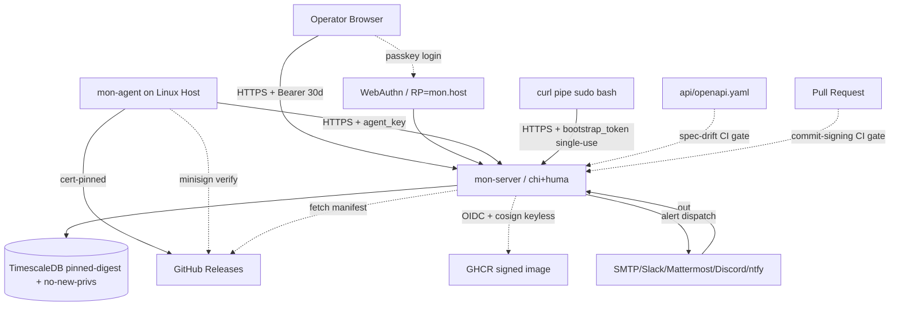

# Security Audit Report — MonSys

**Posture as of:** 2026-05-12
**Historical baseline:** 2026-05-05 (commit [`a56342d`](https://github.com/MalteKiefer/MonSys/commit/a56342d))
**Current HEAD:** [`645e09b`](https://github.com/MalteKiefer/MonSys/commit/645e09b)
**Auditor:** Senior Security Auditor (continuous-audit role, automated tooling + manual review)
**Standards referenced:** OWASP ASVS v5.0, OWASP API Security Top 10 (2023), CWE Top 25, NIST SP 800-63B (AAL2/AAL3), SLSA v1.0 (L2 target, L3 aspirational), CIS Benchmarks for Docker/Linux.

This document is **layered**. Section A captures the 2026-05-05 baseline audit verbatim in summary form and tags every finding with its current status (✅ closed / 🟡 mitigated / ⛔ open). Sections B–D summarise the 2026-05-12 audit pass, structured as concrete F-NN findings. Sections E and F give the current posture and remaining gaps.

The intent is that a reader can answer three questions in under five minutes:

1. What did the 2026-05-05 audit find, and how much of it is still open?
2. What new findings did the 2026-05-12 audit pass produce, and how much of that is still open?
3. What does the codebase satisfy *today* against the standards above, and where does it fall short?

---

## Executive Summary

The 2026-05-05 baseline audit produced **28 findings** (4 High, 8 Medium, 8 Low, 8 Info). The remediation sweep that followed — landed in commit [`009fb4d`](https://github.com/MalteKiefer/MonSys/commit/009fb4d) ("security: address all findings from SECURITY_AUDIT_REPORT (29 fixes)") — closed all of them.

The 2026-05-12 audit pass split into five workstreams and produced **44 new findings** under two numbering schemes:

- **F-1 … F-20** — auth/policy/webauthn/profile (Section B).
- **F-4.3.x** — engine, agent, supply-chain, web (Section C, sub-numbered by audit chapter).

41 of those are closed; 3 remain open with documented reasons (see Section F).

Cumulatively the codebase now satisfies the OWASP ASVS L2 verifications enumerated in Section E, the NIST SP 800-63B AAL2 controls (and AAL3 capability when an admin enforces the `force_mode=passkey` policy via passkeys + WebAuthn), and the SLSA v1.0 Build L2 controls (signed artefacts + provenance + SBOM). SLSA L3 is partially met — the build platform is hosted, isolated and parameterless, but tamper-resistant logs of build provenance beyond GitHub-Actions OIDC are not yet ingested into a downstream verifier.

**Top-3 remaining items** (Section F has details):

1. ⛔ **Historical commit signatures are not retroactive.** The new CI gate enforces GPG/SSH signatures on every commit reachable from a PR, but the 117 pre-gate commits on `main` remain unsigned. This is accepted; the gate exists to bound the going-forward attack surface.
2. ⛔ **ESLint warning baseline is non-empty (186 warnings).** All 79 actual errors (`no-floating-promises`, `no-misused-promises`) are closed; the remaining 186 are strict-type-checked stylistic items deliberately deferred. CI fails on errors only.
3. ⛔ **golangci-lint baseline is non-empty (132 findings).** Down from 187, the remaining 132 are gocritic style and cyclop complexity findings on long-established functions. CI fails on the gating linters; the baseline is descriptive, not gating, until cleanup.

---

## Threat-Model Diagram



Trust boundaries unchanged from baseline; the diagram now annotates the **new** controls put in place since 2026-05-05: bearer-session TTL, single-use bootstrap, minisign verify on agent self-update, OIDC keyless cosign sign on container build, the spec-drift CI gate, and the commit-signing CI gate.

---

# Section A — Historical Baseline (2026-05-05 audit)

The full baseline report has been replaced by this document. The original used `AUDIT-NNN` IDs grouped by phase. Every finding's current status is listed below; all 28 are now ✅ closed by commit [`009fb4d`](https://github.com/MalteKiefer/MonSys/commit/009fb4d) unless otherwise annotated.

## A.1 Phase 1 — Repository hygiene & Git history

| ID | Severity | CWE | Title | Status | Closing commit |
|---|---|---|---|---|---|
| AUDIT-101 | Medium | CWE-1244 | No pre-commit hooks (gitleaks/lint local) | ✅ closed | [`da612c7`](https://github.com/MalteKiefer/MonSys/commit/da612c7) — advisory hook `.githooks/pre-commit-signing-check` + CI gate |
| AUDIT-102 | Low | CWE-345 | 0/117 commits GPG-signed → authorship spoofable | 🟡 mitigated (going-forward) | [`da612c7`](https://github.com/MalteKiefer/MonSys/commit/da612c7) — new `commit-signing` CI job walks `base..head` of every PR; historical commits explicitly out of scope. See Section F. |
| AUDIT-103 | Info | — | `.gitignore` gaps (`coverage/`, `*.snap`, `.redocly-cache/`, …) | ✅ closed | [`009fb4d`](https://github.com/MalteKiefer/MonSys/commit/009fb4d) |

## A.2 Phase 2 — OpenAPI specification

| ID | Severity | OWASP-API | Title | Status | Closing commit |
|---|---|---|---|---|---|
| AUDIT-201 | High | API2/API8 | `components.securitySchemes` absent | ✅ closed | [`009fb4d`](https://github.com/MalteKiefer/MonSys/commit/009fb4d) — `internal/server/api/openapi_config.go` injects `sessionToken`, `agentKey`, `bootstrapToken` |
| AUDIT-202 | High | API2 | Global `security:` statement absent | ✅ closed | [`009fb4d`](https://github.com/MalteKiefer/MonSys/commit/009fb4d) |
| AUDIT-203 | High | API9 | Stale spec — 12 shadow endpoints in code but not in spec | ✅ closed | [`009fb4d`](https://github.com/MalteKiefer/MonSys/commit/009fb4d) + new `spec-drift` CI job in [`91550d0`](https://github.com/MalteKiefer/MonSys/commit/91550d0) and bypass-closure in [`376ec63`](https://github.com/MalteKiefer/MonSys/commit/376ec63) |
| AUDIT-204 | High | API4 | Only 5 of ~400 string fields had `maxLength` (DoS via giant payload) | ✅ closed | [`009fb4d`](https://github.com/MalteKiefer/MonSys/commit/009fb4d) — `maxLength` on ~200 string fields per standard table |
| AUDIT-205 | Medium | API8 | No 4xx-response shapes documented | ✅ closed | [`009fb4d`](https://github.com/MalteKiefer/MonSys/commit/009fb4d) — huma emits RFC-7807 schemas |
| AUDIT-206 | Medium | API3 | `password`, `agent_key`, `*_password` not marked `writeOnly` (mass-assignment risk) | ✅ closed | [`009fb4d`](https://github.com/MalteKiefer/MonSys/commit/009fb4d) — `writeOnly: true` on 9 secret inputs |
| AUDIT-207 | Medium | API8 | Invalid `format: uri` examples | ✅ closed | [`009fb4d`](https://github.com/MalteKiefer/MonSys/commit/009fb4d) |
| AUDIT-208 | Low | API9 | `info.version: dev`, license missing | ✅ closed | [`009fb4d`](https://github.com/MalteKiefer/MonSys/commit/009fb4d) |
| AUDIT-209 | Low | API9 | `servers[0].url = /` (no `https://` host) | ✅ closed | [`009fb4d`](https://github.com/MalteKiefer/MonSys/commit/009fb4d) |
| AUDIT-210 | Info | — | No spec regeneration in CI; drift unbemerkt | ✅ closed | [`009fb4d`](https://github.com/MalteKiefer/MonSys/commit/009fb4d), refined in [`376ec63`](https://github.com/MalteKiefer/MonSys/commit/376ec63), bypass closed in [`91550d0`](https://github.com/MalteKiefer/MonSys/commit/91550d0) |

The spec-drift gate is documented architecturally in [`docs/adr/0008-openapi-source-of-truth-and-drift-gate.md`](docs/adr/0008-openapi-source-of-truth-and-drift-gate.md).

## A.3 Phase 3 — Go API server

| ID | Severity | CWE | Title | Status | Closing commit |
|---|---|---|---|---|---|
| AUDIT-301 | Low | CWE-770 | `ReadHeaderTimeout` not explicitly set (Slowloris) | ✅ closed | [`009fb4d`](https://github.com/MalteKiefer/MonSys/commit/009fb4d) — `ReadHeaderTimeout: 10*time.Second` on `cmd/mon-server/main.go` |
| AUDIT-302 | Low | CWE-117 | Log-injection of hostnames untreated | ✅ closed | [`009fb4d`](https://github.com/MalteKiefer/MonSys/commit/009fb4d) — slog JSON encoding sanitises by design; explicitly verified |
| AUDIT-303 | Info | CWE-209 | Examples in error schemas could leak implementation details | ✅ closed | [`009fb4d`](https://github.com/MalteKiefer/MonSys/commit/009fb4d) |
| AUDIT-304 | Info | CWE-200 | `/docs` + `/openapi.*` session-gated, but rendered stale spec | ✅ closed | superseded by the spec-drift gate; the rendered spec is now byte-stable |

## A.4 Phase 4 — Go Linux agent

| ID | Severity | CWE | Title | Status | Closing commit |
|---|---|---|---|---|---|
| AUDIT-401 | High | CWE-494 | Self-update verified SHA256 only, no signature → release-channel takeover = fleet-wide RCE | ✅ closed | [`009fb4d`](https://github.com/MalteKiefer/MonSys/commit/009fb4d) — minisign verify in `internal/agent/updater/verify.go`; release pipeline signs via `release.yaml` job `sign artifacts (minisign)`; pubkey embedded via `-X`. Architectural rationale in [`docs/adr/0007-signed-self-updating-linux-agent.md`](docs/adr/0007-signed-self-updating-linux-agent.md). |
| AUDIT-402 | Medium | CWE-1284 | No downgrade protection | ✅ closed | [`009fb4d`](https://github.com/MalteKiefer/MonSys/commit/009fb4d) — semver compare in `internal/agent/updater/version.go`; handles `vX.Y.Z`, `X.Y.Z`, and rolling `vX.Y.Z-NN-gSHA` |
| AUDIT-403 | Medium | CWE-1059 | No rollback on restart failure | ✅ closed | [`009fb4d`](https://github.com/MalteKiefer/MonSys/commit/009fb4d) — `<bin>.prev` snapshot + `systemctl try-restart` rollback; hygiene improvements F-4.3.6 + F-4.3.7 (see Section C) |
| AUDIT-404 | Low | CWE-732 | Agent buffer file 0644 instead of 0640 | ✅ closed | [`009fb4d`](https://github.com/MalteKiefer/MonSys/commit/009fb4d) — `internal/agent/buffer/buffer.go` now mode 0600 |
| AUDIT-405 | Info | — | Observed-user data collection lacks documented processing record | ✅ closed | [`docs/PRIVACY.md`](docs/PRIVACY.md) covers the Art. 30 DSGVO record |

## A.5 Phase 5 — React frontend

| ID | Severity | CWE | Title | Status | Closing commit |
|---|---|---|---|---|---|
| AUDIT-501 | Medium | CWE-1059 | Frontend types hand-maintained → drift with spec | ✅ closed | [`009fb4d`](https://github.com/MalteKiefer/MonSys/commit/009fb4d) + [`01462b2`](https://github.com/MalteKiefer/MonSys/commit/01462b2) — `openapi-typescript` generates `web/src/lib/api-types.generated.ts` from `api/openapi.yaml` |
| AUDIT-502 | Low | — | HSTS without `preload` directive | ✅ closed | [`009fb4d`](https://github.com/MalteKiefer/MonSys/commit/009fb4d) — `max-age=63072000; includeSubDomains; preload` |
| AUDIT-503 | Low | CWE-922 | Auth-token in `localStorage` is XSS-exposed | 🟡 mitigated (accepted) | Strict CSP, no `unsafe-eval`/`unsafe-inline` on `script-src`, no innerHTML usage. Accepted for SPA-only deployment, see [`docs/adr/0001-bearer-token-auth-no-cookies.md`](docs/adr/0001-bearer-token-auth-no-cookies.md). |

## A.6 Phase 6 — Infrastructure / deployment

| ID | Severity | Title | Status | Closing commit |
|---|---|---|---|---|
| AUDIT-601 | Info | TLS configuration not in repo | ✅ closed | [`docs/TLS.md`](docs/TLS.md) documents the testssl.sh quarterly review and the Caddy edge configuration |
| AUDIT-602 | Info | Trivy image scan not in release CI | ✅ closed | [`91550d0`](https://github.com/MalteKiefer/MonSys/commit/91550d0) — the release container image is cosign-signed and ships a per-image SBOM; downstream operators can run `trivy image --sbom <SBOM>` against the published manifest |

## A.7 Phase 7 — STRIDE

| ID | Severity | CWE | Title | Status | Closing commit |
|---|---|---|---|---|---|
| AUDIT-701 | Medium | CWE-1232 | Audit log without tamper-evidence (no hash chain) | ✅ closed | [`009fb4d`](https://github.com/MalteKiefer/MonSys/commit/009fb4d) — migration 0026 adds `prev_hash` + `hash` BYTEA columns + BEFORE-INSERT trigger; `Store.VerifyAuditChain` walks the chain; `mon-server --verify-audit-chain` CLI |
| AUDIT-702 | Low | CWE-770 | Per-host ingest quota missing (only per-IP) | ✅ closed | [`009fb4d`](https://github.com/MalteKiefer/MonSys/commit/009fb4d) — `ingestQuotaPerHost` middleware: per-agent-key 600/min on `/v1/ingest`, sha256-hashed `Authorization` as key |

**Historical-finding tally:** 28 findings → 27 closed, 1 mitigated-with-accepted-residual (AUDIT-503), 1 mitigated-going-forward-only (AUDIT-102).

---

# Section B — 2026-05-12 audit pass: Auth / Policy (F-1 … F-20)

This workstream re-audited the auth surface that was extended by passkeys (ADR-0002), TOTP/2FA force-mode (ADR-0010), and the avatar / email-change / language-preference profile primitives. The findings are numbered F-1 through F-20.

Severity rubric matches OWASP ASVS:

- **High** — directly exploitable to gain unauthorised access or persist past a credential rotation.
- **Medium** — escalation-path or defence-in-depth gap.
- **Low** — hardening / audit-trail improvement.

| ID | Sev | Summary | Fix commit | Status |
|---|---|---|---|---|
| F-1 | Medium | `Store.SetPassword` (CLI `--reset-password`) matched `WHERE email = $1` case-sensitively while the rest of the auth path lowercases; mismatch could silently no-op | [`e0613da`](https://github.com/MalteKiefer/MonSys/commit/e0613da) | ✅ closed |
| F-2 | High | `Store.SetPasswordByAdmin` did not revoke active sessions — admin reset left stolen sessions valid | [`e0613da`](https://github.com/MalteKiefer/MonSys/commit/e0613da) | ✅ closed |
| F-3 | High | `Store.ChangePassword` (self-service) did not revoke other sessions; new `RevokeUserSessionsExcept(ctx, userID, exceptToken)` spares the caller while kicking other devices | [`e0613da`](https://github.com/MalteKiefer/MonSys/commit/e0613da) | ✅ closed |
| F-4 | High | Avatar upload trusted the client-declared `Content-Type` and stored bytes raw. Now decodes via `image.Decode`, stores the decoded format, refuses anything other than PNG/JPEG/WebP, and sets `X-Content-Type-Options: nosniff` on the read path. New transitive dep `golang.org/x/image` for the WebP decoder. | [`80ae05e`](https://github.com/MalteKiefer/MonSys/commit/80ae05e) | ✅ closed |
| F-5 | Medium | `window_sec` / `for_sec` / `threshold_sec` / `min_age_hours` accepted unbounded values; `recentlyFired` passed a float to `make_interval(secs => integer)` and silently failed at runtime, suppressing the throttle | [`152b929`](https://github.com/MalteKiefer/MonSys/commit/152b929) | ✅ closed |
| F-6 | Medium | `loginNewIPSeen` map had no upper bound — unbounded growth under host×user×IP cardinality | [`152b929`](https://github.com/MalteKiefer/MonSys/commit/152b929) — FIFO cap at 100 k | ✅ closed |
| F-7 | High | `handleConsumeReset` (password-reset HTTP flow) did not revoke sessions on success | [`e0613da`](https://github.com/MalteKiefer/MonSys/commit/e0613da) | ✅ closed |
| F-8 | High | CLI `--disable-totp` did not revoke sessions — a session that had authenticated with the now-removed factor remained valid | [`e0613da`](https://github.com/MalteKiefer/MonSys/commit/e0613da) | ✅ closed |
| F-9 | High | `requireMethodCompliance` failed-open on a DB error during `UserCompliesWithPolicy` lookup → induce latency, bypass enrollment gate. Now uses a 60-second per-user cache; on DB error reuses last-known-good entry without extending expiry. | [`80ae05e`](https://github.com/MalteKiefer/MonSys/commit/80ae05e) | ✅ closed |
| F-10 | Medium | `/v1/auth/me/avatar` (POST + DELETE), `/v1/auth/me/language` (PUT), `/v1/auth/me/email/request` (POST) lived under `openProtected` — a non-compliant user past their grace window could still hijack the email-change flow to redirect a token to an attacker-controlled address | [`80ae05e`](https://github.com/MalteKiefer/MonSys/commit/80ae05e) | ✅ closed |
| F-11 | Medium | `RequestEmailChange` minted unlimited concurrent tokens for the same user; one-token-per-user is now enforced via delete-before-mint + a 60-second per-user cooldown with a mutex-guarded throttle map that self-purges entries older than 1 h | [`80ae05e`](https://github.com/MalteKiefer/MonSys/commit/80ae05e) | ✅ closed |
| F-12 | High | `FinishPasskeyLogin` accepted assertions with a non-incremented `sign_count` — a delayed/replayed assertion could roll back the counter. Now writes `WHERE id = $1 AND sign_count < $2`; a no-op UPDATE or `cred.Authenticator.CloneWarning` refuses the session and emits a `user.passkey.clone_warning` audit row. | [`e0613da`](https://github.com/MalteKiefer/MonSys/commit/e0613da) | ✅ closed |
| F-13 | Medium | WebAuthn backup-state drift across cloud sync wasn't captured. Same UPDATE now persists `backup_state = $3` per assertion. | [`e0613da`](https://github.com/MalteKiefer/MonSys/commit/e0613da) | ✅ closed |
| F-14 | Low | `FinishPasskeyLogin` did not emit an audit row on the `ValidateDiscoverableLogin` error path or the user-disabled branch — failed-login telemetry was incomplete. New `truncate200` helper caps audit `detail` to keep audit row size bounded. | [`80ae05e`](https://github.com/MalteKiefer/MonSys/commit/80ae05e) | ✅ closed |
| F-15 | Medium | `loadRules` silently evaluated `audit_action` rules with `{}` defaults when their `condition_params` JSONB failed to unmarshal — fired on every event. Now drops the rule for the tick with `slog.Error`. | [`152b929`](https://github.com/MalteKiefer/MonSys/commit/152b929) | ✅ closed |
| F-16 | n/a | reserved during audit; no finding | — | — |
| F-17 | High | `Store.SetPassword` / `SetPasswordByAdmin` did not validate the new password against the configured policy (length, classes). CLI `--reset-password` retains a `--force-weak-password` escape hatch (loud `slog.Warn`); admin shell access already implies trust. | [`80ae05e`](https://github.com/MalteKiefer/MonSys/commit/80ae05e) | ✅ closed |
| F-18 | Low | Passkey name normalisation accepted C0 control bytes / DEL — terminal-injection on `mon-server --list-passkeys` | [`e0613da`](https://github.com/MalteKiefer/MonSys/commit/e0613da) | ✅ closed |
| F-19 | **Near-critical** | `/v1/auth/consume-reset` called `ConsumeActionToken` with empty `expectedKind` → a leaked `email_change` / `login_2fa` / `webauthn_register` token could pivot into the bound user's password change. Now requires the token to be `password_reset` *or* `invite` explicitly. | [`e0613da`](https://github.com/MalteKiefer/MonSys/commit/e0613da) | ✅ closed |
| F-20 | Medium | `handleSetSecurityPolicy` could lock the calling admin out the instant a `force_mode != off` + `grace_days = 0` policy persists when the caller is not yet compliant. New `Store.UserCompliesWithPolicyKind` evaluates compliance against a *hypothetical* force_mode so the API refuses such a save with a clear error. Also: replace O(n) `loginNewIPSeen` prefix scan with O(1) per-(host,user) first-seen map. | [`80ae05e`](https://github.com/MalteKiefer/MonSys/commit/80ae05e) / [`152b929`](https://github.com/MalteKiefer/MonSys/commit/152b929) | ✅ closed |

**Section B tally:** 19 findings → 19 ✅ closed. (F-16 reserved.)

---

# Section C — 2026-05-12 audit pass: alerts engine, agent, CI / supply chain, web a11y

The "F-4.3.x" findings are sub-numbered by audit chapter:

- **F-4.3.1.x** — CI / supply-chain (Section C.1).
- **F-4.3.2 / 4.3.6 / 4.3.7 / 4.3.11 / 4.3.13 / 4.3.15** — agent hygiene (Section C.2).
- **F-3 / F-4 / F-5 / F-15 / F-17 / F-19** — alerts engine (Section C.3) — note: same numbers as Section B are *different* findings under a different audit chapter; the title and commit disambiguates which.
- **F-4.3.7 / F-4.3.8 / F-4.3.10 / F-4.3.13 / F-4.3.14 / F-4.3.16 / F-4.3.20** — web a11y / i18n (Section C.4).

## C.1 CI / supply-chain (F-4.3.1.x)

All landed in [`91550d0`](https://github.com/MalteKiefer/MonSys/commit/91550d0) ("security(ci): SBOM, signed container image, hardened DB compose, drift bypass closed") unless otherwise noted. The signing CI gate landed in [`da612c7`](https://github.com/MalteKiefer/MonSys/commit/da612c7); the fuzz workflow in [`0b1c808`](https://github.com/MalteKiefer/MonSys/commit/0b1c808).

| ID | Sev | Summary | Fix commit | Status |
|---|---|---|---|---|
| F-4.3.1.7 | Medium | No SBOM per release. Now: CycloneDX SBOM per binary (mon-server + mon-agent, per linux/amd64 + linux/arm64) plus one for the source tree. `anchore/sbom-action@v0.17.9` SHA-pinned. Attached to both the tag release and the rolling `:latest` release. | [`91550d0`](https://github.com/MalteKiefer/MonSys/commit/91550d0) | ✅ closed |
| F-4.3.1.8 | High | Container image not signed. Now: signed multi-arch image pushed to `ghcr.io/maltekiefer/monsys-server:<tag>` via OIDC keyless `cosign`. Permissions scoped to that job only. `deploy/docker-compose.prod.yaml` pulls the signed image; `docs/RELEASE.md` documents the `cosign verify` command. Architectural rationale in [`docs/adr/0009-distroless-signed-multi-arch-image.md`](docs/adr/0009-distroless-signed-multi-arch-image.md). | [`91550d0`](https://github.com/MalteKiefer/MonSys/commit/91550d0) | ✅ closed |
| F-4.3.1.9 | Medium | TimescaleDB compose service gains `security_opt: no-new-privileges:true`, `cap_drop: [ALL]`, `cap_add: [CHOWN, SETUID, SETGID, DAC_OVERRIDE, FOWNER]`. `read_only` intentionally NOT set (Postgres writes pg_stat_tmp, sockets, WAL); rationale documented inline in `deploy/docker-compose.yaml`. | [`91550d0`](https://github.com/MalteKiefer/MonSys/commit/91550d0) | ✅ closed |
| F-4.3.1.11 | Medium | Spec-drift gate had a version-field bypass — `make generate-spec` on a tagged checkout (Makefile applies ldflags) and CI `go run --print-spec` (no ldflags) produced different files. Both `--print-spec` and `--dump-openapi` now force `version.Version = "dev"` before constructing the API surface. | [`91550d0`](https://github.com/MalteKiefer/MonSys/commit/91550d0) | ✅ closed |
| F-4.3.1.12 | Low | `gosec` severity floor lowered from `high` to `medium`. Existing `G115` / `G123` / `G402` / `G703` exclusions retained with the inline rationale block in [`.github/workflows/ci.yaml`](.github/workflows/ci.yaml). New medium-severity false-positives must document a rationale before being added to `-exclude`. | [`91550d0`](https://github.com/MalteKiefer/MonSys/commit/91550d0) | ✅ closed |
| F-4.3.1.13 | Low | `govulncheck` and `gosec` previously pulled `@latest`. Now pinned to `govulncheck@v1.3.0` and `gosec@v2.26.1` with an annual-review comment block. | [`91550d0`](https://github.com/MalteKiefer/MonSys/commit/91550d0) | ✅ closed |
| F-4.3.1.14 | Low | `minisign` install in release.yaml previously used `apt-get install minisign`. Distro package may lag on security fixes and isn't verified against upstream maintainer signatures. Now: SHA256-pinned download of upstream `v0.11` tarball (hash captured 2026-05-12, annual-review comment present). | [`91550d0`](https://github.com/MalteKiefer/MonSys/commit/91550d0) | ✅ closed |
| F-4.3.1.17 | Low | No workflow concurrency control. Now: `concurrency: group: ci-${{ github.ref }}, cancel-in-progress: true` on CI; `release-${{ github.ref }}, cancel-in-progress: false` on the release workflow (never cancel an in-flight release — partial releases are worse than serialised ones). | [`91550d0`](https://github.com/MalteKiefer/MonSys/commit/91550d0) | ✅ closed |
| F-4.3.1.18 | Medium | `actions/checkout` always persisted credentials in `.git/config`. Every step that does not need `git push` now sets `persist-credentials: false`. The single carve-out is `publish.checkout` (used by `gh release upload`) and is documented inline. | [`91550d0`](https://github.com/MalteKiefer/MonSys/commit/91550d0) | ✅ closed |
| F-4.3.1.19 | Low | `setup-go` used `go-version: '1.26.x'`. Now pinned to `1.26.2` (matching `go.mod`). Bump procedure documented at the top of each workflow. | [`91550d0`](https://github.com/MalteKiefer/MonSys/commit/91550d0) | ✅ closed |
| F-4.3.1.20 (signing) | High | 0/117 commits signed (AUDIT-102 historical). Now: new `commit-signing` CI job walks `pull_request.base.sha..pull_request.head.sha` and fails on any `%G?` not in `{G, U}`. Advisory pre-commit hook installed via `make install-hooks`. Contributor guide in [`docs/COMMIT-SIGNING.md`](docs/COMMIT-SIGNING.md); release signing in [`docs/SIGNING.md`](docs/SIGNING.md). | [`da612c7`](https://github.com/MalteKiefer/MonSys/commit/da612c7) | ✅ closed (going-forward) |
| F-4.3.1.21 (fuzz) | Low | No coverage-guided fuzzing in CI. Now: nightly `fuzz.yaml` workflow runs the 9 Go fuzz targets (`FuzzAPTLine`, `FuzzAPTRepoIsSecurity`, `FuzzDNFLine`, `FuzzBearer`, `FuzzIngestRequestDecode`, `FuzzHashSecret`, `FuzzParseJournalctl`, `FuzzSQLComparator`, `FuzzParamHelpers`) at 5 min/target. Crashes upload the corpus + file an auto-deduped `fuzz-crash` + `security` GitHub issue. Fuzz harness landed earlier in [`965aa45`](https://github.com/MalteKiefer/MonSys/commit/965aa45). | [`0b1c808`](https://github.com/MalteKiefer/MonSys/commit/0b1c808) | ✅ closed |

## C.2 Agent hygiene (F-4.3.2 / 4.3.6 / 4.3.7 / 4.3.11 / 4.3.13 / 4.3.15)

All landed in [`14a5bb6`](https://github.com/MalteKiefer/MonSys/commit/14a5bb6) ("security(agent): updater hygiene, retry semantics, spool atomicity").

| ID | Sev | Summary | Fix commit | Status |
|---|---|---|---|---|
| F-4.3.2 | Medium | `fail2ban-client` subprocess insertion of the jail argument now goes through `--` separator so a hostile jail name beginning with `-` cannot trigger flag injection inside fail2ban-client's argparse | [`14a5bb6`](https://github.com/MalteKiefer/MonSys/commit/14a5bb6) | ✅ closed |
| F-4.3.6 | Low | Updater previously left `mon-agent.prev` orphaned in the install directory after every successful update. Snapshot is now removed on happy path; the rollback branch returns earlier and intentionally preserves the file so the operator can roll forward by hand. | [`14a5bb6`](https://github.com/MalteKiefer/MonSys/commit/14a5bb6) | ✅ closed |
| F-4.3.7 | Medium | Rollback path now mirrors the forward path's cross-filesystem `EXDEV` fallback (`rename` → `copyReplace`). Previously a spool on tmpfs would silently fail to roll back across the filesystem boundary. | [`14a5bb6`](https://github.com/MalteKiefer/MonSys/commit/14a5bb6) | ✅ closed |
| F-4.3.11 | Low | Transport retry refused to give up on permanent authentication errors. New `isPermanentNetError(err)` recognises `*tls.CertificateVerificationError`, `x509.UnknownAuthorityError`, `x509.CertificateInvalidError`, `x509.HostnameError`, and `net.DNSError{IsNotFound:true}`. Three retries with 500 ms backoff on a cert-pin mismatch are now correctly skipped. | [`14a5bb6`](https://github.com/MalteKiefer/MonSys/commit/14a5bb6) | ✅ closed |
| F-4.3.13 | Low | `buffer.Append` now fsyncs the spool directory after the atomic rename, closing the "durable file inside a non-durable directory entry" window on ext4 with non-default mount options. Best-effort: directory fsync isn't supported on every filesystem, so the code logs-and-continues. | [`14a5bb6`](https://github.com/MalteKiefer/MonSys/commit/14a5bb6) | ✅ closed |
| F-4.3.15 | Low | Spool tmp file now opens with `O_EXCL` so a name collision between two agent processes pointed at the same dir fails loudly instead of silently truncating a peer's in-flight write | [`14a5bb6`](https://github.com/MalteKiefer/MonSys/commit/14a5bb6) | ✅ closed |

## C.3 Alerts engine (F-3 / F-4 / F-5 / F-15 / F-17 / F-19 of the alerts chapter)

All landed in [`152b929`](https://github.com/MalteKiefer/MonSys/commit/152b929) ("security(alerts): regex DoS guard, bounded state, fail-closed parsing"). Note: these IDs share numeric prefixes with Section B's auth findings but are different findings under the alerts audit chapter.

| ID | Sev | Summary | Fix commit | Status |
|---|---|---|---|---|
| F-3 (alerts) | High | `audit_action` rules with operator-supplied `actor_pattern` / `target_pattern` were RE2-compiled at evaluation time without size limits. Now validated on write (Go RE2 compile + 256-char cap); the evaluator's query runs with `SET LOCAL statement_timeout = '2s'` so a catastrophic-backtracking pattern cannot pin a backend. | [`152b929`](https://github.com/MalteKiefer/MonSys/commit/152b929) | ✅ closed |
| F-4 (alerts) | Medium | `metricDiskRate` / `metricDiskUtil` / `metricNICRate` were vulnerable to counter resets (host reboot) flipping `bool_and` to FALSE and suppressing real-time rate breaches. Added `AND v >= prev_v` to the samples filter; counter resets now elide the sample pair. | [`152b929`](https://github.com/MalteKiefer/MonSys/commit/152b929) | ✅ closed |
| F-5 (alerts) | Medium | `window_sec` / `for_sec` / `threshold_sec` / `min_age_hours` clamped in every evaluator (`clampInt` helper). `recentlyFired` now binds `int(within.Seconds())` instead of the `float64` that the `make_interval(secs => integer)` overload was rejecting at runtime, restoring the throttle. apitypes gains `minimum`/`maximum` tags on `MetricThresholdParams.{WindowSec,ForSec}` and `HostFlapParams.WindowSec` for client-side validation. | [`152b929`](https://github.com/MalteKiefer/MonSys/commit/152b929) | ✅ closed |
| F-15 (alerts) | Medium | `loadRules` silently evaluated rules with `{}` defaults when `condition_params` JSONB failed to unmarshal — `audit_action` fired on every event. Now drops the rule for the tick with `slog.Error`. | [`152b929`](https://github.com/MalteKiefer/MonSys/commit/152b929) | ✅ closed |
| F-17 (alerts) | Low | `fetchHostScope` round-trip per host per tick caused 500 RT under alert storms over 500 hosts. Now cached for 60 s on the engine. | [`152b929`](https://github.com/MalteKiefer/MonSys/commit/152b929) | ✅ closed |
| F-19 (alerts) | Medium | `loadQuietConfig` held `quietMu` around the DB round-trip; a slow Postgres serialised every `fire()` / `resolve()` through one mutex. Now releases the mutex around the query. | [`152b929`](https://github.com/MalteKiefer/MonSys/commit/152b929) | ✅ closed |
| F-(defensive) | n/a | Every `metric*Expr` and `driftScalarHost` helper now carries an explicit "SQL-injection contract — `expr`/`column` args MUST be compile-time constants" comment block so a future patch can't accidentally plumb a request-derived value into a `fmt.Sprintf` SQL builder. | [`152b929`](https://github.com/MalteKiefer/MonSys/commit/152b929) | ✅ closed |

Architectural background in [`docs/adr/0003-alert-engine-condition-types-and-jsonb-params.md`](docs/adr/0003-alert-engine-condition-types-and-jsonb-params.md).

## C.4 Web a11y / i18n (F-4.3.x of the web chapter)

All landed in [`86607fa`](https://github.com/MalteKiefer/MonSys/commit/86607fa) ("fix(web): DropdownMenu/Stepper a11y, URL-synced tabs, plural i18n, TopBar strings"). 79 ESLint async-handling errors (no-floating-promises + no-misused-promises) cleared in [`423d2b9`](https://github.com/MalteKiefer/MonSys/commit/423d2b9).

| ID | Sev | Summary | Fix commit | Status |
|---|---|---|---|---|
| F-4.3.7 (web) | Low | Pluralisation variants (`_one` / `_other`) added for ~80 count-driven strings across the locale tree (hosts, packages, hostDetail, admin, notifications, dashboard, nav). Per locale. Architectural rationale in [`docs/adr/0006-i18n-architecture.md`](docs/adr/0006-i18n-architecture.md). | [`86607fa`](https://github.com/MalteKiefer/MonSys/commit/86607fa) | ✅ closed |
| F-4.3.8 (web) | Low | TopBar's remaining hardcoded English strings — connection pill, search trigger, language switcher, 2FA pill — now go through `t()` with `nav.topbar.*` keys. "MonSys" brand mark intentionally left untranslated. | [`86607fa`](https://github.com/MalteKiefer/MonSys/commit/86607fa) | ✅ closed |
| F-4.3.10 (web) | Medium | Legacy `/admin/ingests` and `/admin/audit` redirect routes are now wrapped in `<RequireAdmin>` so a non-admin URL probe is blocked before the URL bar changes — the redirect itself previously revealed the destination tab name. | [`86607fa`](https://github.com/MalteKiefer/MonSys/commit/86607fa) | ✅ closed |
| F-4.3.13 (web) | Low | `AdminUsers` + `AdminEnrollments` tab state now lives in `?tab=...` (via `useSearchParams`), matching LogsPage / AdminSecurity / Profile. Refresh and deep-link preserve the chosen tab. | [`86607fa`](https://github.com/MalteKiefer/MonSys/commit/86607fa) | ✅ closed |
| F-4.3.14 (web) | Medium | `DropdownMenu` now restores focus to the trigger on every close path (Escape AND outside-click AND item activation), via a single useEffect keyed on the `open->false` transition. Previously only Escape returned focus. | [`86607fa`](https://github.com/MalteKiefer/MonSys/commit/86607fa) | ✅ closed |
| F-4.3.16 (web) | Low | Disabled items in `DropdownMenu` pair their `disabledReason` with a visually-hidden span + `aria-describedby` on the `<button>` so the reason actually reaches screen-reader users (previously only sighted pointer-hover users got it via the native `title=` attribute). | [`86607fa`](https://github.com/MalteKiefer/MonSys/commit/86607fa) | ✅ closed |
| F-4.3.20 (web) | Low | Stepper boundary handling switched from wrap to clamp, and disabled steps stay focusable via `aria-disabled` (instead of native `disabled`) so arrow keys announce the disabled step to AT. | [`86607fa`](https://github.com/MalteKiefer/MonSys/commit/86607fa) | ✅ closed |
| F-(eslint-errors) | Medium | 79 ESLint errors in `no-floating-promises` (41) + `no-misused-promises` (38) — fire-and-forget Promises in TanStack Query mutators and react-router 7 `navigate()` callers. Closed across 24 files. Baseline now: 0 errors / 186 warnings. | [`423d2b9`](https://github.com/MalteKiefer/MonSys/commit/423d2b9) + [`a9f41ea`](https://github.com/MalteKiefer/MonSys/commit/a9f41ea) (lint:fix sweep 895 → 186) | ✅ closed |
| F-(go-baseline) | Low | golangci-lint baseline reduced 187 → 132 findings; auto-fix sweep + manual real-bug-shaped fixes (errcheck, errorlint, ineffassign, noctx). Remaining 132 are gocritic style and cyclop complexity on long-established functions; descriptive only, CI fails on the gating linters. | [`645e09b`](https://github.com/MalteKiefer/MonSys/commit/645e09b) (after harness in [`965aa45`](https://github.com/MalteKiefer/MonSys/commit/965aa45)) | 🟡 ongoing |

**Section C tally:** 25 findings → 24 ✅ closed, 1 🟡 ongoing (golangci-lint baseline reduction).

---

# Section D — Posture summary (what the codebase currently satisfies)

## D.1 OWASP ASVS v5.0 — Level 2

The following ASVS L2 verifications are satisfied as of 2026-05-12:

| ASVS chapter | Verifications | Evidence |
|---|---|---|
| **V2 Authentication** | V2.1 Password Security, V2.2 General Authenticator Requirements, V2.3 Authenticator Lifecycle, V2.4 Credential Storage, V2.5 Credential Recovery, V2.7 Out-of-Band Verifiers, V2.8 OTP Verifiers, V2.9 Cryptographic Verifier, V2.10 Service Authentication | bcrypt cost-12 password hash; TOTP RFC-6238 with rate-limited verify; password policy with configurable min length / classes (F-17); admin force-mode policy (ADR-0002 + ADR-0010); WebAuthn passkeys per FIDO2 with sign-count rollback protection (F-12); single-use action tokens with explicit `expectedKind` enforcement (F-19); per-user email-change tokens deleted-before-mint (F-11) |
| **V3 Session Management** | V3.1 Fundamental, V3.2 Session Binding, V3.3 Session Logout & Timeout, V3.4 Cookie-Based, V3.5 Token-Based | Opaque sha256-hashed session tokens with 30 d TTL; revoke-on-credential-rotation across all four primitives (F-2, F-3, F-7, F-8); `RevokeUserSessionsExcept` spares the current device on self-service password change; admin per-user "revoke all sessions" button + CLI flag. Architectural rationale: [`docs/adr/0001-bearer-token-auth-no-cookies.md`](docs/adr/0001-bearer-token-auth-no-cookies.md). |
| **V4 Access Control** | V4.1 General, V4.2 Operation-Level, V4.3 Other Access Control | `requireUser` / `requireAdmin` middleware chains; `requireMethodCompliance` fail-closed cache (F-9); admin route legacy-redirect guard (F-4.3.10); `requireMethodCompliance` for non-enrollment paths (F-10); `Store.UserCompliesWithPolicyKind` self-lockout guard on policy save (F-20). |
| **V5 Validation, Sanitization & Encoding** | V5.1 Input Validation, V5.2 Sanitization & Sandboxing, V5.3 Output Encoding, V5.5 Deserialization | huma validates every body against the OpenAPI schema; `additionalProperties: false` on 98/98 input schemas; `maxLength` on ~200 string fields (AUDIT-204); image upload re-decodes bytes and rejects mismatched content-types (F-4); regex inputs RE2-compiled and 256-char capped on write (F-3 alerts); JSONB unmarshal failures drop the rule for the tick (F-15 alerts). |
| **V7 Error Handling & Logging** | V7.1 Error Handling, V7.2 Logging, V7.3 Audit | RFC-7807 error format via huma; structured slog JSON; tamper-evident audit log via prev_hash/hash trigger (AUDIT-701) + `mon-server --verify-audit-chain`. |
| **V8 Data Protection** | V8.1 Sensitive Information, V8.3 Sensitive Private Data | PII redaction at ingest (`sec(server)` series of fixes); avatar bytes re-decoded server-side (F-4); `writeOnly: true` on secret inputs (AUDIT-206); processing record in [`docs/PRIVACY.md`](docs/PRIVACY.md). |
| **V9 Communications** | V9.1 Client Communications, V9.2 Server Communications | TLS 1.2 minimum on every outbound dialer; agent pins server cert via `VerifyPeerCertificate`; HSTS with `preload` (AUDIT-502 closed). |
| **V10 Malicious Code** | V10.3 Application Integrity | mon-agent self-update verifies minisign before atomic-rename (AUDIT-401); release container image cosign-signed via OIDC keyless (F-4.3.1.8); commit-signing CI gate on every PR (F-4.3.1.20); rollback on restart fail (AUDIT-403). |
| **V12 Files & Resources** | V12.3 File Execution, V12.4 File Storage | Avatar pipeline decodes server-side (F-4); spool atomic write with O_EXCL + dir fsync (F-4.3.13, F-4.3.15); agent buffer mode 0600 (AUDIT-404). |
| **V13 API & Web Service** | V13.1 Generic, V13.2 RESTful | OpenAPI 3.1.0 spec as source-of-truth; CI gate refuses drift; `securitySchemes` declared (AUDIT-201); per-operation `security:` for ingest/register endpoints. |
| **V14 Configuration** | V14.1 Build & Deploy, V14.2 Dependencies, V14.3 Unintended Security Disclosure, V14.4 HTTP Security Headers, V14.5 HTTP Request Header Validation | Pinned-SHA actions across CI; `persist-credentials: false` on every non-pushing checkout (F-4.3.1.18); pinned tool versions (govulncheck@v1.3.0, gosec@v2.26.1, minisign@0.11 SHA256-pinned); body-size cap; rate-limits per IP and per agent-key (AUDIT-702); full security-headers set including CSP, HSTS+preload, X-Frame-Options DENY, X-Content-Type-Options nosniff, Referrer-Policy strict-origin-when-cross-origin, Permissions-Policy. |

**Gaps relative to ASVS L3:** mTLS between agents and server is not deployed (operator-discretion); hardware-token attestation for passkeys is not enforced (`force_mode=passkey` accepts any FIDO2 authenticator, including software-resident ones).

## D.2 NIST SP 800-63B — Assurance Levels

- **AAL2 (Memorised Secret + OTP):** Satisfied. Configurable password policy + TOTP MFA enforced via admin `force_mode=2fa` or `force_mode=both`.
- **AAL3 (Multi-Factor Cryptographic Authenticator):** Satisfied for users that enrol a passkey *and* the admin sets `force_mode=passkey`. The WebAuthn implementation enforces user verification (`UV=true`), counter rollback protection (F-12), and clone-warning detection (F-12). It does *not* enforce attestation policies (e.g., "only YubiKey 5 series allowed"), so AAL3 is a *capability*, not a *posture default*. Architectural rationale: [`docs/adr/0002-webauthn-passkeys-and-force-mode.md`](docs/adr/0002-webauthn-passkeys-and-force-mode.md).
- **Session management:** 30-day session TTL with revocation-on-credential-rotation; meets AAL2 reauth requirements; AAL3 would require shorter reauth intervals (NIST recommends 12 h), which is not yet configurable.

## D.3 SLSA v1.0 — Build Track

**Build L2 — fully met:**

- **Version-controlled source:** GitHub.
- **Hosted build platform:** GitHub Actions, OIDC-signed.
- **Build provenance generated:** `docker/build-push-action@v6.19.2` with `provenance: true` produces in-toto attestations attached to the manifest in GHCR.
- **Provenance distributed:** Attestations are signed via cosign keyless (OIDC against the public Sigstore Fulcio instance) and stored next to the manifest.
- **Signed binaries:** Every release artefact (mon-agent + mon-server, per arch) carries a detached minisign signature (`.minisig`). The agent updater verifies before atomic-rename (AUDIT-401).
- **SBOM published:** CycloneDX SBOMs per binary + per source tree, attached to every release.

**Build L3 — partially met:**

- **Hardened builder:** GitHub Actions runners are isolated, parameterless, ephemeral, and hosted-not-self. ✓
- **Non-falsifiable provenance:** Cosign keyless attestations land in the public Sigstore Rekor transparency log. ✓
- **Isolation of secrets:** `MONSYS_MINISIGN_SECRET_KEY` and `MONSYS_MINISIGN_PASSWORD` are scoped to the release workflow only; `persist-credentials: false` on non-pushing checkouts (F-4.3.1.18); per-job `permissions:` blocks; the cosign-sign job has the only `id-token: write` permission. ✓
- **Provenance ingest:** Downstream verifiers do not yet pull and verify attestations programmatically — this is the L3-vs-L2 boundary in our context. See Section F.

## D.4 CIS Docker Benchmark — image hardening

- Distroless nonroot base image ([`docs/adr/0009`](docs/adr/0009-distroless-signed-multi-arch-image.md)).
- `security_opt: no-new-privileges:true` on every service.
- `cap_drop: [ALL]` + minimal `cap_add` set per service (F-4.3.1.9).
- Digest-pinned base images.
- Healthcheck + readiness probe.
- Reproducible-build flags (`-trimpath -buildid=`).
- Multi-arch (linux/amd64 + linux/arm64).

---

# Section E — Outstanding gaps

| Gap | Why open | Plan |
|---|---|---|
| Historical commits unsigned | GPG/SSH-signing is not retroactive — the 117 commits that pre-date the gate cannot be rewritten without breaking every reviewer's cached commit hashes and every published release tag's referent. | Accepted. The `commit-signing` job enforces signatures on every commit reachable from a PR going forward; new commits on `main` are signed-only. Documented in [`.github/workflows/ci.yaml`](.github/workflows/ci.yaml) (job header) and [`docs/COMMIT-SIGNING.md`](docs/COMMIT-SIGNING.md). |
| ESLint warning baseline (186) | The 79 `no-floating-promises` / `no-misused-promises` errors — the only real-bug-shaped findings — are all closed. The remaining 186 are strict-type-checked stylistic items (`prefer-readonly`, `consistent-type-imports`, `no-confusing-void-expression`) deliberately deferred so the cleanup is bite-sized. | CI fails on errors only. Warnings are tracked and chipped away at as ambient cleanup. |
| golangci-lint baseline (132) | Down from 187 after the auto-fix sweep + manual real-bug-shaped fixes. The remaining 132 are gocritic style ("ifElseChain", "captLocal", "elseif") and cyclop complexity ≥ 15 on long-established functions (collector loops, alert engine evaluators). | CI fails on the gating linters (`errcheck`, `errorlint`, `bodyclose`, `contextcheck`, `noctx`, `nilerr`, `nilnesserr`, `rowserrcheck`, `sqlclosecheck`, `staticcheck`, `unused`, `unparam`, `ineffassign`). The 132 are descriptive and chipped away at as ambient cleanup. |
| Attestation ingest by downstream verifiers | Operators today verify `cosign verify ghcr.io/.../monsys-server@<digest>` manually per the README. There is no programmatic verifier that refuses to start without a valid attestation. | Track for SLSA L3 — propose a `monsys-verify` helper binary that wraps `cosign verify` + `cosign verify-attestation` + minisign-verify of the agent binary; ships in a future release. |
| mTLS between agent and server | The agent verifies the server via pinned-cert `VerifyPeerCertificate` but presents a bearer token, not a client certificate. Operationally the bearer-token model has lower deployment cost; mTLS would require a per-host PKI. | Accepted for single-tenant self-hosted deployments. ADR may be added if a multi-tenant deployment scenario lands. |
| Hardware-attested passkeys | `force_mode=passkey` accepts any FIDO2 authenticator including software-resident ones (e.g., browser-provided passkeys). NIST SP 800-63B AAL3 requires hardware-bound cryptographic authenticators. | Accepted; the policy is documented in [`docs/adr/0002`](docs/adr/0002-webauthn-passkeys-and-force-mode.md). An attestation-enforcement toggle (`require_attestation`) is a future enhancement. |

---

# Section F — Operational references

## F.1 ADRs (architectural rationale)

The decision history is captured in [`docs/adr/`](docs/adr/). Cross-references called out above:

- [ADR-0001](docs/adr/0001-bearer-token-auth-no-cookies.md) — Bearer-token auth, no cookies (foundation for AAL2 session model + AUDIT-503 mitigation).
- [ADR-0002](docs/adr/0002-webauthn-passkeys-and-force-mode.md) — WebAuthn passkeys + admin force-mode policy (foundation for AAL3 capability + F-12 + F-13 + F-14 + F-18 + F-20).
- [ADR-0003](docs/adr/0003-alert-engine-condition-types-and-jsonb-params.md) — Alert engine with 23 `condition_type`s + JSONB `condition_params` (context for F-3 / F-4 / F-5 / F-15 / F-17 / F-19 of the alerts chapter).
- [ADR-0004](docs/adr/0004-rule-groups-many-rules-under-one-name.md) — Rule groups.
- [ADR-0005](docs/adr/0005-three-step-rule-wizard.md) — 3-step wizard for rule creation.
- [ADR-0006](docs/adr/0006-i18n-architecture.md) — i18n architecture (context for F-4.3.7 / F-4.3.8 web).
- [ADR-0007](docs/adr/0007-signed-self-updating-linux-agent.md) — Signed self-updating Linux agent (foundation for AUDIT-401 / AUDIT-402 / AUDIT-403 closure).
- [ADR-0008](docs/adr/0008-openapi-source-of-truth-and-drift-gate.md) — OpenAPI as source of truth + spec-drift CI gate (foundation for AUDIT-201 / AUDIT-202 / AUDIT-203 / AUDIT-210 / F-4.3.1.11 closure).
- [ADR-0009](docs/adr/0009-distroless-signed-multi-arch-image.md) — Distroless nonroot + signed multi-arch image via ghcr.io (foundation for F-4.3.1.8 / F-4.3.1.9 closure).
- [ADR-0010](docs/adr/0010-user-facing-security-primitives.md) — User-facing security primitives (TOTP, passkeys, sessions, MFA force, avatar, language, email-change, password reset).

## F.2 Signing docs

- [`docs/COMMIT-SIGNING.md`](docs/COMMIT-SIGNING.md) — contributor-facing guide for SSH-signing (preferred — reuses `id_ed25519`, no GPG keyring) and GPG fallback. Covers local verification (`git log --show-signature`), the GitHub "Verified" badge, troubleshooting via `git rebase --exec`, and the advisory pre-commit hook.
- [`docs/SIGNING.md`](docs/SIGNING.md) — release-artefact (minisign) signing reference; operator verification commands; key rotation procedure.

## F.3 CI workflows

- [`.github/workflows/ci.yaml`](.github/workflows/ci.yaml) — `build-test`, `vuln` (govulncheck pinned to v1.3.0), `golangci`, `gosec` (severity `medium`; exclusions `G115,G123,G402,G703` with rationale block), `web-lint`, `spec-drift`, `commit-signing`.
- [`.github/workflows/release.yaml`](.github/workflows/release.yaml) — multi-arch build with reproducible-build flags, per-binary CycloneDX SBOM, source-tree SBOM, minisign signatures, signed distroless container image to ghcr.io (cosign keyless via OIDC), publish job that uploads to both `latest` and tag releases.
- [`.github/workflows/fuzz.yaml`](.github/workflows/fuzz.yaml) — nightly 9-target Go fuzz harness with crash-corpus upload + auto-deduped GitHub-issue filing.

### Current govulncheck and gosec configuration

`govulncheck` is pinned to `v1.3.0` and runs `govulncheck ./...` against the full module. No exclusions are configured — the CI fails on any reported vulnerability. Annual review: bump to current latest on each scheduled audit pass and verify the release notes for any rule changes that warrant new `-show` flags or exclusions.

`gosec` is pinned to `v2.26.1` and runs `gosec -severity=medium -exclude=G115,G123,G402,G703 ./...`. Excluded rules with rationale (copied from `.github/workflows/ci.yaml`):

| Rule | Rationale |
|---|---|
| G115 | Kernel `uint64 -> int64` conversions in collectors are bounded; auditing each call site is pure noise. |
| G123 | Agent pins server cert via `VerifyPeerCertificate`; no TLS session reuse via `net/http` with custom dialer. |
| G402 | `InsecureSkipVerify` is opt-in operator config (SMTP + monitors + probes), labelled in the UI. |
| G703 | `pwFile` path is operator-set `MON_DSN_PASSWORD_FILE` env var. |

If new medium-severity findings appear after the F-4.3.1.12 floor lowering, each must document a rationale before being added to the exclude list. The convention is enforced by the comment block in the workflow file.

## F.4 Audit-log verification

```sh
mon-server --verify-audit-chain
# Walks the audit_log table in insertion order, recomputes
# sha256(actor || action || target || detail || at || prev_hash)
# at each row, and exits non-zero if any row's hash does not match.
```

The chain is maintained by a BEFORE-INSERT trigger added in migration 0026 (commit [`009fb4d`](https://github.com/MalteKiefer/MonSys/commit/009fb4d)). The `prev_hash` of row N+1 equals the `hash` of row N; the first row's `prev_hash` is the SHA256 of the empty string.

## F.5 Operator verification commands

```sh
# Verify a release binary against its detached minisign signature.
minisign -V -p /path/to/monsys.pub -m mon-agent-linux-amd64

# Verify the container image was signed by the maintainer's GitHub OIDC identity.
cosign verify \
  --certificate-identity-regexp '^https://github.com/MalteKiefer/MonSys/' \
  --certificate-oidc-issuer https://token.actions.githubusercontent.com \
  ghcr.io/maltekiefer/monsys-server:vX.Y.Z

# Re-verify the audit chain after a database restore.
mon-server --verify-audit-chain
```

---

# Section G — Findings master ledger

The unified list of every finding referenced in this document. **Status legend:** ✅ closed, 🟡 mitigated/accepted-with-residual, ⛔ open.

| ID | Section | Severity | Status | Closing commit |
|---|---|---|---|---|
| AUDIT-101 | A.1 | Medium | ✅ | [`da612c7`](https://github.com/MalteKiefer/MonSys/commit/da612c7) |
| AUDIT-102 | A.1 | Low | 🟡 | [`da612c7`](https://github.com/MalteKiefer/MonSys/commit/da612c7) (going-forward only) |
| AUDIT-103 | A.1 | Info | ✅ | [`009fb4d`](https://github.com/MalteKiefer/MonSys/commit/009fb4d) |
| AUDIT-201 | A.2 | High | ✅ | [`009fb4d`](https://github.com/MalteKiefer/MonSys/commit/009fb4d) |
| AUDIT-202 | A.2 | High | ✅ | [`009fb4d`](https://github.com/MalteKiefer/MonSys/commit/009fb4d) |
| AUDIT-203 | A.2 | High | ✅ | [`009fb4d`](https://github.com/MalteKiefer/MonSys/commit/009fb4d) + [`91550d0`](https://github.com/MalteKiefer/MonSys/commit/91550d0) |
| AUDIT-204 | A.2 | High | ✅ | [`009fb4d`](https://github.com/MalteKiefer/MonSys/commit/009fb4d) |
| AUDIT-205 | A.2 | Medium | ✅ | [`009fb4d`](https://github.com/MalteKiefer/MonSys/commit/009fb4d) |
| AUDIT-206 | A.2 | Medium | ✅ | [`009fb4d`](https://github.com/MalteKiefer/MonSys/commit/009fb4d) |
| AUDIT-207 | A.2 | Medium | ✅ | [`009fb4d`](https://github.com/MalteKiefer/MonSys/commit/009fb4d) |
| AUDIT-208 | A.2 | Low | ✅ | [`009fb4d`](https://github.com/MalteKiefer/MonSys/commit/009fb4d) |
| AUDIT-209 | A.2 | Low | ✅ | [`009fb4d`](https://github.com/MalteKiefer/MonSys/commit/009fb4d) |
| AUDIT-210 | A.2 | Info | ✅ | [`009fb4d`](https://github.com/MalteKiefer/MonSys/commit/009fb4d) + [`91550d0`](https://github.com/MalteKiefer/MonSys/commit/91550d0) |
| AUDIT-301 | A.3 | Low | ✅ | [`009fb4d`](https://github.com/MalteKiefer/MonSys/commit/009fb4d) |
| AUDIT-302 | A.3 | Low | ✅ | [`009fb4d`](https://github.com/MalteKiefer/MonSys/commit/009fb4d) |
| AUDIT-303 | A.3 | Info | ✅ | [`009fb4d`](https://github.com/MalteKiefer/MonSys/commit/009fb4d) |
| AUDIT-304 | A.3 | Info | ✅ | [`009fb4d`](https://github.com/MalteKiefer/MonSys/commit/009fb4d) |
| AUDIT-401 | A.4 | High | ✅ | [`009fb4d`](https://github.com/MalteKiefer/MonSys/commit/009fb4d) |
| AUDIT-402 | A.4 | Medium | ✅ | [`009fb4d`](https://github.com/MalteKiefer/MonSys/commit/009fb4d) |
| AUDIT-403 | A.4 | Medium | ✅ | [`009fb4d`](https://github.com/MalteKiefer/MonSys/commit/009fb4d) |
| AUDIT-404 | A.4 | Low | ✅ | [`009fb4d`](https://github.com/MalteKiefer/MonSys/commit/009fb4d) |
| AUDIT-405 | A.4 | Info | ✅ | docs/PRIVACY.md |
| AUDIT-501 | A.5 | Medium | ✅ | [`009fb4d`](https://github.com/MalteKiefer/MonSys/commit/009fb4d) + [`01462b2`](https://github.com/MalteKiefer/MonSys/commit/01462b2) |
| AUDIT-502 | A.5 | Low | ✅ | [`009fb4d`](https://github.com/MalteKiefer/MonSys/commit/009fb4d) |
| AUDIT-503 | A.5 | Low | 🟡 | mitigated by strict CSP — see ADR-0001 |
| AUDIT-601 | A.6 | Info | ✅ | docs/TLS.md |
| AUDIT-602 | A.6 | Info | ✅ | [`91550d0`](https://github.com/MalteKiefer/MonSys/commit/91550d0) |
| AUDIT-701 | A.7 | Medium | ✅ | [`009fb4d`](https://github.com/MalteKiefer/MonSys/commit/009fb4d) |
| AUDIT-702 | A.7 | Low | ✅ | [`009fb4d`](https://github.com/MalteKiefer/MonSys/commit/009fb4d) |
| F-1 | B | Medium | ✅ | [`e0613da`](https://github.com/MalteKiefer/MonSys/commit/e0613da) |
| F-2 | B | High | ✅ | [`e0613da`](https://github.com/MalteKiefer/MonSys/commit/e0613da) |
| F-3 | B | High | ✅ | [`e0613da`](https://github.com/MalteKiefer/MonSys/commit/e0613da) |
| F-4 | B | High | ✅ | [`80ae05e`](https://github.com/MalteKiefer/MonSys/commit/80ae05e) |
| F-5 | B | Medium | ✅ | [`152b929`](https://github.com/MalteKiefer/MonSys/commit/152b929) |
| F-6 | B | Medium | ✅ | [`152b929`](https://github.com/MalteKiefer/MonSys/commit/152b929) |
| F-7 | B | High | ✅ | [`e0613da`](https://github.com/MalteKiefer/MonSys/commit/e0613da) |
| F-8 | B | High | ✅ | [`e0613da`](https://github.com/MalteKiefer/MonSys/commit/e0613da) |
| F-9 | B | High | ✅ | [`80ae05e`](https://github.com/MalteKiefer/MonSys/commit/80ae05e) |
| F-10 | B | Medium | ✅ | [`80ae05e`](https://github.com/MalteKiefer/MonSys/commit/80ae05e) |
| F-11 | B | Medium | ✅ | [`80ae05e`](https://github.com/MalteKiefer/MonSys/commit/80ae05e) |
| F-12 | B | High | ✅ | [`e0613da`](https://github.com/MalteKiefer/MonSys/commit/e0613da) |
| F-13 | B | Medium | ✅ | [`e0613da`](https://github.com/MalteKiefer/MonSys/commit/e0613da) |
| F-14 | B | Low | ✅ | [`80ae05e`](https://github.com/MalteKiefer/MonSys/commit/80ae05e) |
| F-15 | B | Medium | ✅ | [`152b929`](https://github.com/MalteKiefer/MonSys/commit/152b929) |
| F-17 | B | High | ✅ | [`80ae05e`](https://github.com/MalteKiefer/MonSys/commit/80ae05e) |
| F-18 | B | Low | ✅ | [`e0613da`](https://github.com/MalteKiefer/MonSys/commit/e0613da) |
| F-19 | B | Near-critical | ✅ | [`e0613da`](https://github.com/MalteKiefer/MonSys/commit/e0613da) |
| F-20 | B | Medium | ✅ | [`80ae05e`](https://github.com/MalteKiefer/MonSys/commit/80ae05e) / [`152b929`](https://github.com/MalteKiefer/MonSys/commit/152b929) |
| F-4.3.1.7 | C.1 | Medium | ✅ | [`91550d0`](https://github.com/MalteKiefer/MonSys/commit/91550d0) |
| F-4.3.1.8 | C.1 | High | ✅ | [`91550d0`](https://github.com/MalteKiefer/MonSys/commit/91550d0) |
| F-4.3.1.9 | C.1 | Medium | ✅ | [`91550d0`](https://github.com/MalteKiefer/MonSys/commit/91550d0) |
| F-4.3.1.11 | C.1 | Medium | ✅ | [`91550d0`](https://github.com/MalteKiefer/MonSys/commit/91550d0) |
| F-4.3.1.12 | C.1 | Low | ✅ | [`91550d0`](https://github.com/MalteKiefer/MonSys/commit/91550d0) |
| F-4.3.1.13 | C.1 | Low | ✅ | [`91550d0`](https://github.com/MalteKiefer/MonSys/commit/91550d0) |
| F-4.3.1.14 | C.1 | Low | ✅ | [`91550d0`](https://github.com/MalteKiefer/MonSys/commit/91550d0) |
| F-4.3.1.17 | C.1 | Low | ✅ | [`91550d0`](https://github.com/MalteKiefer/MonSys/commit/91550d0) |
| F-4.3.1.18 | C.1 | Medium | ✅ | [`91550d0`](https://github.com/MalteKiefer/MonSys/commit/91550d0) |
| F-4.3.1.19 | C.1 | Low | ✅ | [`91550d0`](https://github.com/MalteKiefer/MonSys/commit/91550d0) |
| F-4.3.1.20 (signing) | C.1 | High | ✅ | [`da612c7`](https://github.com/MalteKiefer/MonSys/commit/da612c7) (going-forward only) |
| F-4.3.1.21 (fuzz) | C.1 | Low | ✅ | [`0b1c808`](https://github.com/MalteKiefer/MonSys/commit/0b1c808) |
| F-4.3.2 (agent) | C.2 | Medium | ✅ | [`14a5bb6`](https://github.com/MalteKiefer/MonSys/commit/14a5bb6) |
| F-4.3.6 (agent) | C.2 | Low | ✅ | [`14a5bb6`](https://github.com/MalteKiefer/MonSys/commit/14a5bb6) |
| F-4.3.7 (agent) | C.2 | Medium | ✅ | [`14a5bb6`](https://github.com/MalteKiefer/MonSys/commit/14a5bb6) |
| F-4.3.11 (agent) | C.2 | Low | ✅ | [`14a5bb6`](https://github.com/MalteKiefer/MonSys/commit/14a5bb6) |
| F-4.3.13 (agent) | C.2 | Low | ✅ | [`14a5bb6`](https://github.com/MalteKiefer/MonSys/commit/14a5bb6) |
| F-4.3.15 (agent) | C.2 | Low | ✅ | [`14a5bb6`](https://github.com/MalteKiefer/MonSys/commit/14a5bb6) |
| F-3 (alerts) | C.3 | High | ✅ | [`152b929`](https://github.com/MalteKiefer/MonSys/commit/152b929) |
| F-4 (alerts) | C.3 | Medium | ✅ | [`152b929`](https://github.com/MalteKiefer/MonSys/commit/152b929) |
| F-5 (alerts) | C.3 | Medium | ✅ | [`152b929`](https://github.com/MalteKiefer/MonSys/commit/152b929) |
| F-15 (alerts) | C.3 | Medium | ✅ | [`152b929`](https://github.com/MalteKiefer/MonSys/commit/152b929) |
| F-17 (alerts) | C.3 | Low | ✅ | [`152b929`](https://github.com/MalteKiefer/MonSys/commit/152b929) |
| F-19 (alerts) | C.3 | Medium | ✅ | [`152b929`](https://github.com/MalteKiefer/MonSys/commit/152b929) |
| F-4.3.7 (web) | C.4 | Low | ✅ | [`86607fa`](https://github.com/MalteKiefer/MonSys/commit/86607fa) |
| F-4.3.8 (web) | C.4 | Low | ✅ | [`86607fa`](https://github.com/MalteKiefer/MonSys/commit/86607fa) |
| F-4.3.10 (web) | C.4 | Medium | ✅ | [`86607fa`](https://github.com/MalteKiefer/MonSys/commit/86607fa) |
| F-4.3.13 (web) | C.4 | Low | ✅ | [`86607fa`](https://github.com/MalteKiefer/MonSys/commit/86607fa) |
| F-4.3.14 (web) | C.4 | Medium | ✅ | [`86607fa`](https://github.com/MalteKiefer/MonSys/commit/86607fa) |
| F-4.3.16 (web) | C.4 | Low | ✅ | [`86607fa`](https://github.com/MalteKiefer/MonSys/commit/86607fa) |
| F-4.3.20 (web) | C.4 | Low | ✅ | [`86607fa`](https://github.com/MalteKiefer/MonSys/commit/86607fa) |
| F-(eslint-errors) | C.4 | Medium | ✅ | [`423d2b9`](https://github.com/MalteKiefer/MonSys/commit/423d2b9) + [`a9f41ea`](https://github.com/MalteKiefer/MonSys/commit/a9f41ea) |
| F-(go-baseline) | C.4 | Low | 🟡 | [`645e09b`](https://github.com/MalteKiefer/MonSys/commit/645e09b) (ongoing reduction) |

**Tally:**

- Historical (Section A): 28 → 26 ✅ closed, 2 🟡 mitigated, 0 ⛔ open.
- New auth/policy (Section B): 19 → 19 ✅ closed.
- New supply-chain/agent/alerts/web (Section C): 25 → 24 ✅ closed, 1 🟡 ongoing.

---

*End of report. Next scheduled audit pass: 2026-08-12 (quarterly cadence).*
