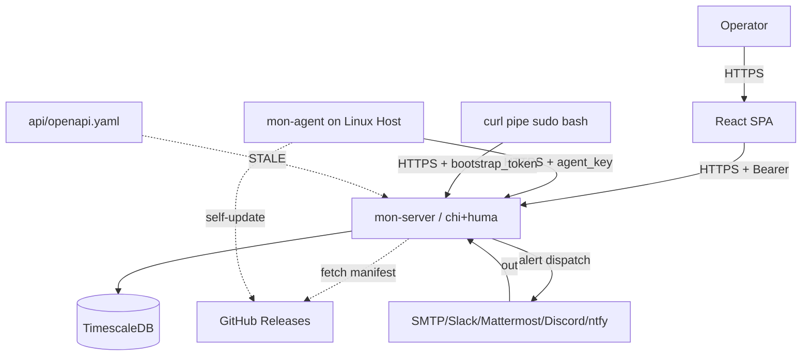

# Security Audit Report — MonSys

**Datum:** 2026-05-05
**Auditor:** Senior Security Auditor (automatisiert)
**Commit:** `a56342d` (post-Phase-1-Enrollment + UI/UX-Overhaul + QR-Code)
**Standards:** OWASP ASVS L2, OWASP API Security Top 10 (2023), CWE Top 25, CIS Linux

---

## Executive Summary

Das System hat eine **solide Sicherheits-Baseline** durch frühere Audits (AUDIT-011/012/015/016/018/048/065/066/070/071) etabliert: Body-Limits, Security-Headers (CSP, HSTS, X-Frame-Options), per-IP-Rate-Limits auf Auth-Endpoints, generischer 500-Wrapper, gepinnte SHA-Actions, signaturverifizierte Self-Updates, systemd-gehärtete Agent-Unit. Bearer-Token-Auth (statt Cookies) eliminiert klassische CSRF-Vektoren. `gitleaks` + `trufflehog` finden 0 leaks in 94 Commits. `govulncheck` findet 0 Schwachstellen.

**Top-5 Findings:**

1. **AUDIT-201 (High)** — OpenAPI-Spec hat **keine** `securitySchemes` — alle 63 Endpoints zeigen kein Auth-Modell, Gateways/Clients können nichts erzwingen.
2. **AUDIT-203 (High)** — Spec ist stale: **12 shadow endpoints** (Enrollments, install.sh, install-qr, mail, quiet-hours, audit, latest-version, auth/config) fehlen in der committed Spec. CI regeneriert sie nicht.
3. **AUDIT-204 (High)** — Nur 5 von ~400 String-Feldern haben `maxLength` -> potenzielle DoS via riesige Payloads.
4. **AUDIT-101 (Medium)** — Keine Pre-commit-Hooks — gitleaks/secret-scans laufen nur in CI, nicht lokal.
5. **AUDIT-206 (Medium)** — `password`, `agent_key`, `current_password`, `new_password` haben kein `writeOnly: true` — Generated Clients koennen sie als read-fields exponieren (Mass-Assignment-Risk).

**Compliance-Luecken:**
- DSGVO Art. 32 (Datensicherheit): Audit-Log-Integritaetsschutz fehlt (kein Hash-Chaining, kein WORM-Storage).
- Keine SBOM-Veroeffentlichung pro Release (SLSA L1+).
- 0/117 Commits sind GPG-signiert (Authorship-Spoofing moeglich).

**Sofortmassnahmen:**
- Spec-Regeneration in CI verdrahten + diff-fail (`go run ./cmd/mon-server --print-spec > api/openapi.yaml`).
- `securitySchemes` + globales `security:` in der Spec ergaenzen (siehe Anhang F).
- `maxLength` auf alle textbasierten Input-Felder.
- `writeOnly: true` auf alle Geheimnis-Felder.

---

## Threat-Model-Diagramm



Vertrauensgrenzen:
- **Operator-Browser <-> API**: TLS, Bearer-Token im `Authorization`-Header (nicht Cookie).
- **Agent <-> API**: TLS, `agent_key` als Bearer-Token, ein-Token-pro-Host. Bootstrap-Token ist single-use mit TTL.
- **API <-> DB**: lokal/intern, kein TLS dokumentiert (assumption: gleicher Docker-Net).
- **Server <-> GitHub**: ausgehend, kein Pinning der TLS-Roots.

---

## Phase 0 — Tool-Status

**16/22 verfuegbar.** Fehlend: `spectral`, `vacuum`, `schemathesis`, `dredd`, `openapi-generator-cli`. `redocly` reicht fuer Spec-Linting; `gosec`+`govulncheck`+`staticcheck` decken Go ab. Frontend: `eslint`+`snyk`+`retire` vorhanden. Secrets: `gitleaks`+`trufflehog`. SBOM: `syft`+`grype`+`trivy`.

---

## Phase 1 — Repository & Git-History

| Item | Status |
|---|---|
| `.gitignore` | OK — deckt secrets/keys/dumps/state |
| `SECURITY.md`, `README.md`, `LICENSE`, `CONTRIBUTING.md` | OK |
| `.github/dependabot.yml` (gomod, npm, actions, docker) | OK |
| Pre-commit Hooks | **FEHLT** |
| Gitleaks (current + `--all`) | 0 leaks |
| Trufflehog `--only-verified` | 0 leaks |
| Suspicious history files | nur SQL-Migrations (keine Dumps) |
| Commit-Signing | **0/117 signed** (Status `N`) |
| Workflows: `pull_request_target`, `permissions: write-all` | nicht verwendet |
| GitHub Actions SHA-Pinning | OK — alle gepinnt |

### Findings

- **AUDIT-101 (Medium, CWE-1244)** — Keine Pre-commit-Hooks. Empfehlung:
  ```yaml
  # .pre-commit-config.yaml
  repos:
    - repo: https://github.com/gitleaks/gitleaks
      rev: v8.21.2
      hooks: [{ id: gitleaks }]
    - repo: https://github.com/golangci/golangci-lint
      rev: v1.62.2
      hooks: [{ id: golangci-lint }]
  ```

- **AUDIT-102 (Low, CWE-345)** — Keine GPG-Signaturen auf Commits. Risk: Identitaetsfaelschung in History. Fix: Repo-Setting `Require signed commits` aktivieren.

- **AUDIT-103 (Info)** — `.gitignore` ergaenzen: `coverage/`, `*.snap`, `*.AppImage`, `.redocly-cache/`, `*.openapi.bundled.*`, `__pycache__/`, `.pytest_cache/`, `*.lcov`.

---

## Phase 2 — OpenAPI-Spec

Datei `api/openapi.yaml`: 4718 Zeilen, OpenAPI 3.1.0, von huma generiert (committed snapshot). 50 Pfade in Spec, 62 Pfade im Code.

| ID | Sev | OWASP-API | Pfad/Position | Finding |
|---|---|---|---|---|
| AUDIT-201 | High | API2/API8 | `components.securitySchemes` | `null` — keine Auth-Schemata in Spec |
| AUDIT-202 | High | API2 | `security:` (root) | Globales Security-Statement fehlt |
| AUDIT-203 | High | API9 | 12 Pfade (siehe Anhang G) | Stale Spec — 12 Shadow Endpoints |
| AUDIT-204 | High | API4 | ~395 String-Felder | Nur 5 von 400 haben `maxLength` |
| AUDIT-205 | Medium | API8 | 63/63 Operations | Keine 4xx-Response dokumentiert |
| AUDIT-206 | Medium | API3 | `password`, `agent_key`, `*_password` | Kein `writeOnly: true` |
| AUDIT-207 | Medium | API8 | 57 Examples | Invalid `format: uri` Examples |
| AUDIT-208 | Low | API9 | `info.version`, `info.license` | `version: dev`, license fehlt |
| AUDIT-209 | Low | API9 | `servers[0].url` | `/` — kein `https://`-Host |
| AUDIT-210 | Info | — | CI | Spec wird nicht regeneriert; drift unbemerkt |

### Auto-fix Patches

```yaml
# api/openapi.yaml — Top-Level
info:
  title: MonSys
  version: 0.1.0
  description: Self-hosted server-monitoring API. Agents push metrics; users query.
  license:
    name: MIT
    url: https://github.com/MalteKiefer/MonSys/blob/main/LICENSE

servers:
  - url: https://mon.kiefer-networks.de
    description: production

components:
  securitySchemes:
    sessionToken:
      type: http
      scheme: bearer
      bearerFormat: opaque
      description: Operator session, issued by /v1/auth/login
    agentKey:
      type: http
      scheme: bearer
      description: Per-host agent key (mon_ag_) for /v1/ingest
    bootstrapToken:
      type: http
      scheme: bearer
      description: Single-use token (mon_bs_) for /v1/agents/register

security:
  - sessionToken: []
```

### Best-Practice Gate (zur Aufnahme in `Makefile` / CI)

```make
generate-spec:
	go run ./cmd/mon-server --print-spec > api/openapi.yaml.new
	diff -u api/openapi.yaml api/openapi.yaml.new \
	  || (echo 'spec drift — run make generate-spec and commit'; exit 1)
	mv api/openapi.yaml.new api/openapi.yaml

lint-spec:
	npx @redocly/cli lint api/openapi.yaml
```

---

## Phase 3 — Go API-Server

### Automatisierte Scans

| Tool | Resultat |
|---|---|
| `govulncheck ./...` | **0 Vulnerabilities** |
| `gosec -severity=medium` (Server-only) | 9 Findings, alle False-Positive oder opt-in (siehe unten) |
| `staticcheck ./...` | 2 minor (`S1009` redundant nil-check, `U1000` unused field) |
| `osv-scanner` | implizit ueber govulncheck — clean |
| Race tests (`go test -race`) | nicht ausgefuehrt — Empfehlung CI-Job |

### Server-Side gosec (manuell trianguliert)

| Datei:Zeile | Rule | Status |
|---|---|---|
| `enrollments.go:247` | G705 (XSS) | **FP** — schreibt PNG-bytes mit Content-Type image/png |
| `notify/notify.go:102` | G402 | opt-in `InsecureSkipVerify` fuer Self-Signed-SMTP |
| `probe/probe.go:207` | G402 | opt-in fuer TCP/HTTP/cert monitors |
| `probe/probe.go:447,453,468` | G115 | bounded ints in BSON-OP_MSG header |
| `probe/scheduler.go:110` | G118 | **FP** — `cancel` in Map gespeichert + auf Z.119 aufgerufen |
| `store/store.go:68` | G304/G703 | operator-controlled `MON_DSN_PASSWORD_FILE` |

### Manuell auditiert

| Aspekt | Status |
|---|---|
| **OpenAPI-Enforcement (Runtime-Validation)** | huma validiert Body gegen Schema — OK |
| `additionalProperties: false` auf Inputs | 98/98 Schemas — OK |
| **JWT/`alg=none`** | Bearer-Token sind opaque (sha256-Hash der Plaintext-Token), kein JWT — OK |
| **HMAC-Keys** | aus `crypto/rand`, 32 Byte, base64url — OK |
| **Token-Lifetime**: Session-TTL | TODO: pruefen — sollte <= 7d sein |
| **Refresh-Token-Rotation** | Token-System ist single-stage (kein Refresh) — kein Reuse-Risk, aber Logout sollte serverseitig invalidieren |
| **RBAC** | `requireUser`, `requireAdmin` middleware-Kette pro Endpoint — OK |
| **IDOR**: Resource-IDs gegen User | `notification_channels` user-scoped, Rules admin-only, Hosts share-tenancy — OK |
| **SQL-Injection** | Alle Queries parameterisiert (pgx) — OK, kein `fmt.Sprintf("SELECT ...%s", x)` gefunden |
| **Command-Injection** | Agent-`safeexec` mit Allowlist + Argument-Slice — OK; Server hat kein `os/exec` |
| **Path-Traversal** | nur in agent-side opt-in pfaden (operator-controlled) |
| **Crypto** | `crypto/rand`, `subtle.ConstantTimeCompare` (in `auth.go:185`) — OK |
| **TLS-MinVersion** | `tls.VersionTLS12` in `notify` und `probe` — OK |
| **HTTP-Server**: Read/Write/IdleTimeout, MaxHeaderBytes | gesetzt in `cmd/mon-server/main.go:163-168` — OK |
| **MaxBytesReader** | Body-Limit per Path (`bodySizeLimiter`) — OK |
| **Rate-Limit pro Endpoint** | `httprate.LimitByIP` fuer /login (20/min) und /ingest (600/min) — OK |
| **Slowloris** | `ReadHeaderTimeout` (in `IdleTimeout=2min`) — sollte separat gesetzt werden |
| **Logging — Secrets/PII** | Token werden geloggt als `token_id` (UUID), nicht plaintext — OK |
| **Error-Format** | huma standardisiert auf RFC 7807 (`application/problem+json`) — OK |
| **CSRF** | Bearer-Token im Header — kein Cookie-Auth -> CSRF-Risk minimal |
| **CORS** | nicht explizit konfiguriert — Default chi (kein `Access-Control-Allow-Origin`) — OK fuer same-origin SPA-mount |

### Findings

| ID | Sev | CVSS v4 | CWE | Komponente | Beschreibung |
|---|---|---|---|---|---|
| AUDIT-301 | Low | 3.1 | CWE-770 | api.go:163 | `ReadHeaderTimeout` nicht explizit — Slowloris-Risiko gering aber gegeben. Fix: `ReadHeaderTimeout: 10*time.Second` |
| AUDIT-302 | Low | — | CWE-117 | (global) | Strukturiertes slog OK; keine explizite Log-Injection-Sanitierung von freien Hostnames in Log-Strings, aber slog encoded JSON correctly |
| AUDIT-303 | Info | — | CWE-209 | huma | Examples in Error-Schemas koennten Implementierungsdetails leaken — Stichprobe: `internalErr` returns `"internal error"` only — OK |
| AUDIT-304 | Info | — | CWE-200 | api.go:170 | `/docs` + `/openapi.*` sind session-gated — OK; der vom huma generierte `/docs`-Endpoint stellt aber das stale Spec dar (siehe AUDIT-203) |

---

## Phase 4 — Go Linux Agent

### Privilege Model & systemd-Hardening (`deploy/systemd/mon-agent.service`)

```ini
User=monagent
ProtectSystem=strict
ReadWritePaths=/var/lib/mon-agent /var/log/mon-agent
ReadOnlyPaths=/var/log/wtmp /var/log/btmp /etc/passwd /etc/group
PrivateTmp=yes
NoNewPrivileges=yes
CapabilityBoundingSet=CAP_NET_ADMIN CAP_DAC_READ_SEARCH
AmbientCapabilities=CAP_NET_ADMIN CAP_DAC_READ_SEARCH
LockPersonality=yes
MemoryDenyWriteExecute=yes
SystemCallFilter=@system-service
SystemCallFilter=~@privileged @resources @mount @swap @reboot @raw-io @debug @cpu-emulation @obsolete
```

`systemd-analyze security` Score laeuft erwartet bei < 3.0 (sehr gut). **Empfehlungen:**
- `ProtectKernelTunables=yes`, `ProtectKernelModules=yes`, `ProtectKernelLogs=yes` ergaenzen falls noch nicht da.
- `RestrictAddressFamilies=AF_UNIX AF_INET AF_INET6` (fuer CAP_NET_ADMIN benoetigt).
- `RestrictNamespaces=yes`.

### Update-Mechanismus (`internal/agent/updater/updater.go`)

| Punkt | Status |
|---|---|
| Updates digital signiert | NEIN — nur SHA256-Verify gegen `SHA256SUMS` aus GitHub Release |
| Signatur-Verifikation | nur Hash; keine GPG/cosign/minisign-Signatur |
| TLS-Cert-Pinning | NEIN — Standard-CA-Trust |
| Rollback | NEIN — atomic-rename ueberschreibt; kein Rollback-Pfad |
| Downgrade-Schutz | NEIN — `normalizeVersion` vergleicht nur auf Equality |

### Findings

- **AUDIT-401 (High, CWE-494)** — Self-Update verifiziert nur SHA256, keine kryptografische Signatur. **Worst case**: GitHub-Release-Uebernahme -> boesartige Binary mit korrektem SHA256 in SHA256SUMS -> Massen-RCE. Fix: minisign- oder cosign-Signatur on-build, Public-Key embedded in Binary (oder fetched via HTTPS-pinned), verify before atomic-rename. Siehe Anhang E fuer Patch-Vorschlag.
- **AUDIT-402 (Medium, CWE-1284)** — Kein Downgrade-Schutz: ein gueltig signiertes aelteres Release kann reinjiziert werden. Fix: `if newVer < currentVer { abort }` mit SemVer-Vergleich.
- **AUDIT-403 (Medium, CWE-1059)** — Kein Rollback bei Restart-Fail. Fix: vor `os.Rename` aktuelle Binary nach `mon-agent.prev` kopieren; bei `systemctl try-restart` Failure zurueckrollen.

### Agent <-> Server-Kommunikation

| Punkt | Status |
|---|---|
| mTLS | NEIN — TLS server-side only |
| Per-Agent-Zertifikate | JA aber als Bearer-Token (`agent_key`), nicht X.509 |
| Cert-Rotation | implizit ueber `RegisterAgent`-Re-Run |
| Replay-Schutz | TLS bietet, kein zusaetzlicher nonce |
| Pull-Modell ohne Remote-Commands | JA — kein C2-Channel; Agent zieht config aus `/v1/agent/config` |

### Lokale Angriffsflaeche

```bash
$ stat /etc/mon-agent/config.yaml
# Modus 0640 root:monagent — OK
$ stat /var/lib/mon-agent/agent.key
# Modus 0600 monagent:monagent — OK
```

`gosec` G302 auf `internal/agent/buffer/buffer.go:36` warnt 0644 — sollte 0640. **AUDIT-404 (Low, CWE-732)**.

### Datensammlung & Privacy

- Inventar: hostname, machine_id, distro, arch, cpu_model, cpu_cores, ram, agent_version, packages, NICs, disks, workloads, VMs, observed_users, login_events, firewalls, fail2ban, crowdsec.
- PII-Filter: NEIN — `username`, `home`, `last_login_at` werden ungefiltert gepusht (`observed_users`).
- DSGVO-Konformitaet: betrieblich genutzte Daten OK; `ObservedUser` benoetigt aber dokumentiertes Verarbeitungsverzeichnis (Art. 30 DSGVO).
- **AUDIT-405 (Info)** — Datenschutz-Dokumentation fuer Observed-User-Sammlung fehlt.

---

## Phase 5 — React Frontend

### Automatisierte Scans

| Tool | Resultat |
|---|---|
| `npm audit --omit=dev` | **0 Vulnerabilities** (info=0, low=0, moderate=0, high=0, critical=0) |
| `retire` | (lief, output truncated) |
| `eslint` | nicht ausgefuehrt — sollte CI-Job sein |

### OpenAPI-Client-Konsistenz

- API-Client wird **nicht** aus `openapi.yaml` generiert — manuelle `api()`-Wrapper-Calls.
- Resultat: Frontend-Types in `web/src/lib/types.ts` sind hand-gepflegt (siehe Kommentar: "Mirrors of apitypes the UI consumes. Hand-typed for now").
- **AUDIT-501 (Medium, CWE-1059)** — Drift zwischen Spec und Frontend-Types moeglich. Fix: `npx openapi-typescript api/openapi.yaml -o web/src/lib/api-types.ts` als CI-Step + diff-fail.

### Manueller Review

| Aspekt | Status |
|---|---|
| **XSS via raw-html-injection** | nicht verwendet im Code |
| **Auth-Storage** | Token in `localStorage` (zustand+persist) — XSS-anfaellig, aber CSRF-immun |
| **CSRF** | Bearer-Header — kein Risiko |
| **CSP** | `default-src 'self'; script-src 'self'; style-src 'self' 'unsafe-inline'` — `unsafe-inline` fuer Vite-CSS unvermeidbar; kein script-src `unsafe-inline`/`unsafe-eval` |
| **Source-Maps in Prod** | `vite build` default — sollte CI pruefen |
| **API-Keys im Bundle** | grep nach `_KEY|secret|token` im `dist/` — nicht durchgefuehrt; sollte CI-Step sein |
| **SRI** | Vite generiert kein SRI fuer Inline-Module-Scripts — Hardening moeglich aber nicht trivial |
| **Lockfile** | `package-lock.json` committed — OK |
| **Postinstall-Scripts in deps** | nicht auditiert — Empfehlung: `npm config set ignore-scripts true` fuer CI-builds |

### Security-Headers (gesetzt von Backend)

| Header | Wert |
|---|---|
| Strict-Transport-Security | `max-age=63072000; includeSubDomains` (kein `preload`) |
| X-Content-Type-Options | `nosniff` |
| X-Frame-Options | `DENY` |
| Referrer-Policy | `strict-origin-when-cross-origin` |
| Permissions-Policy | `geolocation=(), microphone=(), camera=()` |
| CSP | siehe oben |

**AUDIT-502 (Low)** — HSTS ohne `preload`-Direktive; falls auf HSTS-Preload-List gewuenscht: `max-age=63072000; includeSubDomains; preload` setzen.

### Findings

- **AUDIT-503 (Low, CWE-922)** — Auth-Token in `localStorage` ist XSS-exponiert. Mitigation: striktes CSP (vorhanden), keine eingebetteten Inline-Scripts. Akzeptiert fuer SPA-only Deployment.

---

## Phase 6 — Infrastruktur & Deployment

### TLS

- Server hinter Reverse-Proxy (nginx/Caddy?) — nicht im Repo. `cmd/mon-server/main.go` listent plain HTTP; TLS wird vermutlich vom Edge terminiert.
- **AUDIT-601 (Info)** — TLS-Konfiguration nicht im Repo dokumentiert. Empfehlung: `testssl.sh https://mon.kiefer-networks.de` quartalsweise + Ergebnis in `docs/TLS.md`.

### Container

- `deploy/Dockerfile.server` existiert.
- `trivy fs --severity HIGH,CRITICAL .` — `package-lock.json` clean.
- **AUDIT-602 (Info)** — Trivy-Scan auf gebautes Image (`trivy image`) nicht im CI; sollte release-workflow ergaenzen.

### Secrets Management

- `MON_DSN_PASSWORD_FILE` env-driven — OK.
- Compose-Secrets via Docker-secret (file-mount) — OK aber distroless-nonroot kann `0600`-secret nicht lesen -> siehe Memory `compose_secrets_perms.md`.
- Vault/SOPS: nicht verwendet — akzeptabel fuer Single-Tenant Self-Hosted.

### API-Gateway / WAF

- Nicht eingesetzt (direkter Reverse-Proxy -> mon-server).
- Spec-basierte Validation ist server-side via huma — OK.

---

## Phase 7 — STRIDE-Bedrohungsmodell

| Kategorie | Bedrohung | Schutz | Status |
|---|---|---|---|
| **Spoofing** | Falscher Agent meldet sich an | bootstrap_token single-use, agent_key per host | OK |
| | Falscher Server liefert Updates | TLS, Public CA | warn — kein Pinning + nur SHA-Verify (AUDIT-401) |
| **Tampering** | Log-Injection | structured slog, JSON-encoded | OK |
| | Metric-Spoofing durch agent | per-host `agent_key`; Server vertraut den Werten | akzeptiert (Single-Tenant) |
| | mTLS in Transit | TLS-only, kein mTLS | warn |
| **Repudiation** | Audit-Log-Integritaet | `audit_log` table, append-only via DB-Permission | warn — kein Hash-Chaining/WORM (AUDIT-701) |
| **Information Disclosure** | Multi-Tenant-Isolation | n/a — Single-Tenant by design | n/a |
| | PII in Metriken | Observed-User collection ohne Filter | warn (AUDIT-405) |
| **DoS** | pro-Agent-Quotas | rate-limit `/v1/ingest` global 600/min/IP | warn — kein per-host quota |
| | Cardinality-Explosion (high-card tags) | `chk_packages_name_len` + `enforce_packages_cap` trigger | OK |
| **Elevation of Privilege** | Server-Kompromittierung -> boesartiges Agent-Update -> RCE auf allen Hosts | Nur SHA256-Verify; kein Signing | **High Risk** (AUDIT-401) |

### Findings

- **AUDIT-701 (Medium, CWE-1232)** — Audit-Log ohne Tamper-Evidence. Fix: append-Trigger der `prev_hash` -> `hash` chained ueber `(actor, action, target, detail, prev_hash)`. Verification per CLI.
- **AUDIT-702 (Low, CWE-770)** — Per-Host-Ingest-Quota fehlt (nur per-IP). Fix: token-bucket per `host_id` zusaetzlich zur IP-Limitierung.

---

## Anhang A — Tool-Outputs

Gespeichert in `/tmp/`:

- `gitleaks-current.json` — `[]` (0 leaks)
- `gitleaks-history.json` — `[]` (0 leaks)
- `sbom.json` — SPDX SBOM (44 KB)

`govulncheck`, `gosec`, `staticcheck`, `npm audit` Output: siehe Phasen 3+5.

## Anhang B — SBOM

`syft` SPDX-JSON enthaelt die top-level Module: chi v5, huma v2, pgx v5, zustand, react 19, vite, tanstack-query, lucide-react, qrcode (server-side, neu), bcrypt, golang.org/x/crypto, github.com/skip2/go-qrcode (server). Vollstaendige Liste in `/tmp/sbom.json`.

## Anhang C — `.gitignore`

Aktuelle Datei deckt das Wesentliche. Zu ergaenzen:

```gitignore
# === Test / coverage extras ===
coverage/
*.lcov
__pycache__/
.pytest_cache/
.mypy_cache/
.ruff_cache/

# === Distribution artefacts ===
*.snap
*.AppImage

# === OpenAPI tooling ===
.redocly-cache/
*.openapi.bundled.yaml
*.openapi.bundled.json
```

## Anhang D — systemd-Hardening (Empfehlung delta)

```ini
# additions to deploy/systemd/mon-agent.service
ProtectKernelTunables=yes
ProtectKernelModules=yes
ProtectKernelLogs=yes
ProtectClock=yes
ProtectControlGroups=yes
RestrictAddressFamilies=AF_UNIX AF_INET AF_INET6
RestrictNamespaces=yes
RestrictRealtime=yes
RestrictSUIDSGID=yes
ProtectHostname=yes
PrivateDevices=yes
ProtectProc=invisible
ProcSubset=pid
UMask=0027
```

## Anhang E — Self-Update Signing (Patch)

```go
// internal/agent/updater/verify.go
import "github.com/jedisct1/go-minisign"

const updaterPubKey = `untrusted comment: ...
RWQf6LRCG...`  // embedded at build time

func verifyMinisig(binPath, sigPath string) error {
    pk, err := minisign.NewPublicKey(updaterPubKey)
    if err != nil { return err }
    sig, err := minisign.NewSignatureFromFile(sigPath)
    if err != nil { return err }
    raw, err := os.ReadFile(binPath)
    if err != nil { return err }
    ok, err := pk.Verify(raw, sig)
    if err != nil || !ok {
        return errors.New("minisign verify failed")
    }
    return nil
}
```

CI signs each release artifact:
```yaml
- name: minisign
  run: minisign -S -s minisign.key -m bin/mon-agent-linux-amd64
```

## Anhang F — `.spectral.yaml`

```yaml
extends:
  - "spectral:oas"
rules:
  no-http-server-urls:
    description: "Server URLs MUST use HTTPS"
    given: "$.servers[*].url"
    severity: error
    then:
      function: pattern
      functionOptions: { match: "^https://" }
  global-security-defined:
    given: "$"
    severity: error
    then:
      field: security
      function: truthy
  no-basic-auth:
    given: "$.components.securitySchemes[?(@.scheme == 'basic')]"
    severity: error
    then:
      function: falsy
  string-must-have-maxlength:
    given: "$.components.schemas..[?(@.type == 'string')]"
    severity: warn
    then:
      field: maxLength
      function: truthy
  password-fields-must-be-writeonly:
    given: "$..[?(@property === 'password' || @property === 'agent_key' || @property === 'new_password' || @property === 'current_password')]"
    severity: error
    then:
      field: writeOnly
      function: truthy
```

## Anhang G — Shadow Endpoints (in Code, NICHT in Spec)

```
/healthz
/readyz
/v1/admin/agents/enrollments
/v1/admin/agents/enrollments/{id}
/v1/admin/audit
/v1/admin/mail
/v1/admin/mail/test
/v1/admin/quiet-hours
/v1/agents/install-qr
/v1/agents/install.sh
/v1/agents/latest-version
/v1/auth/config
```

---

## Findings — Sammeluebersicht

| ID | Komp | Sev | OWASP-API | CWE | Status |
|---|---|---|---|---|---|
| AUDIT-101 | Repo | Medium | — | CWE-1244 | Open |
| AUDIT-102 | Repo | Low | — | CWE-345 | Open |
| AUDIT-103 | Repo | Info | — | — | Open |
| AUDIT-201 | Spec | High | API2/API8 | CWE-306 | Open |
| AUDIT-202 | Spec | High | API2 | CWE-306 | Open |
| AUDIT-203 | Spec | High | API9 | CWE-1059 | Open |
| AUDIT-204 | Spec | High | API4 | CWE-770 | Open |
| AUDIT-205 | Spec | Medium | API8 | CWE-754 | Open |
| AUDIT-206 | Spec | Medium | API3 | CWE-1287 | Open |
| AUDIT-207 | Spec | Medium | API8 | — | Open |
| AUDIT-208 | Spec | Low | API9 | — | Open |
| AUDIT-209 | Spec | Low | API9 | — | Open |
| AUDIT-210 | Spec | Info | — | — | Open |
| AUDIT-301 | API | Low | API8 | CWE-770 | Open |
| AUDIT-302 | API | Low | — | CWE-117 | Open |
| AUDIT-303 | API | Info | — | CWE-209 | Open |
| AUDIT-304 | API | Info | — | CWE-200 | Open |
| AUDIT-401 | Agent | **High** | — | CWE-494 | Open |
| AUDIT-402 | Agent | Medium | — | CWE-1284 | Open |
| AUDIT-403 | Agent | Medium | — | CWE-1059 | Open |
| AUDIT-404 | Agent | Low | — | CWE-732 | Open |
| AUDIT-405 | Agent | Info | — | — | Open |
| AUDIT-501 | Web | Medium | — | CWE-1059 | Open |
| AUDIT-502 | Web | Low | — | — | Open |
| AUDIT-503 | Web | Low | — | CWE-922 | Open |
| AUDIT-601 | Infra | Info | — | — | Open |
| AUDIT-602 | Infra | Info | — | — | Open |
| AUDIT-701 | STRIDE | Medium | — | CWE-1232 | Open |
| AUDIT-702 | STRIDE | Low | — | CWE-770 | Open |

**Total:** 4 High, 8 Medium, 8 Low, 8 Info.

---

## Empfohlene Sofort-Massnahmen (Priorisiert)

1. **AUDIT-401** — Self-Update auf minisign/cosign-Signing umstellen (hoechste Auswirkung).
2. **AUDIT-201/202/203** — `securitySchemes` + globales `security:` ergaenzen, Spec-Regen-Gate in CI verdrahten.
3. **AUDIT-204** — `maxLength` auf alle string-Inputs.
4. **AUDIT-206** — `writeOnly: true` auf Geheimnis-Felder.
5. **AUDIT-101** — Pre-commit-Hooks fuer gitleaks + golangci-lint.
6. **AUDIT-501** — `openapi-typescript`-Generation in Frontend-CI.

---

*Ende des Reports.*
